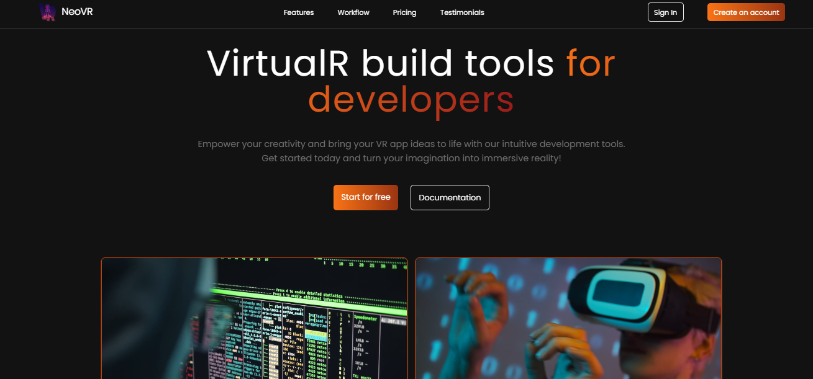
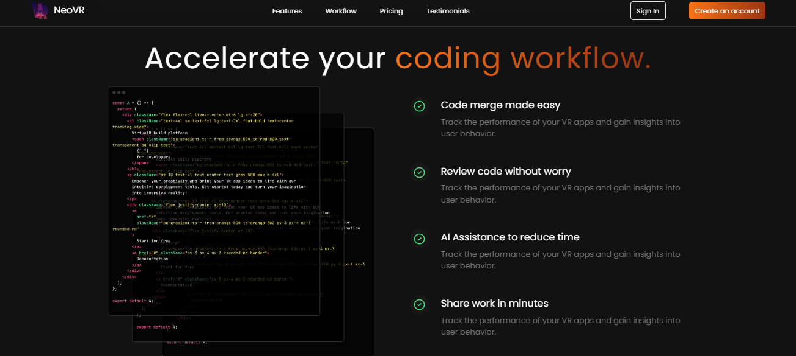
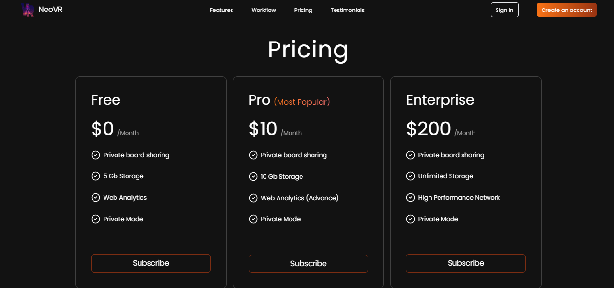

# Neo-VR


## <a name="introduction">💬 Introduction</a>

A lightweight and modular platform for building immersive 3D virtual experiences. Designed for developers, educators, and enterprises to create, manage, and deploy VR content effortlessly across devices.

## <a name="preview">📸 Preview</a>
<p align="center">
  
<br>
  
  
<br>
  
  
<br>
</p>

## 🎯 Live Demo  
🔗 **[Check out the live demo here](https://neo-vr.vercel.app/)**  

## <a name="tools">🛠️ Tools</a>

-   [React JS](https://react.dev)
-   [TailwindCSS](https://tailwindcss.com/)
-   [Lucide Icons](https://lucide.dev/)

## <a name="features">✨ Features</a>

- 🌍 Immersive UI/UX – A sleek, modern interface optimized for a futuristic VR experience.
- 📱  Responsive Design: Fully optimized for desktop and mobile devices.
- 🚀 Optimized Performance: Fast loading with efficient state management.
- 📜 Engaging Content Layouts – Well-structured sections for seamless user flow.


## <a name="getting-started">🚀 Getting Started</a>

To get started follow these steps:

#### Cloning the Repository

Using CLI

```bash
git clone https://github.com/smRid/NeoVR.git
```

**\*\*_Ensure you have installed [Git](https://git-scm.com) on your machine._**

or using GitHub:

-   Go to the project [repository](https://github.com/smRid/NeoVR.git) on my GitHub page
-   Click on the green button on the top 👆
-   Click Download ZIP

#### Installation

Install the project dependencies using npm:

```bash
npm install
```

**\*\*_Ensure you have installed [NodeJS](https://nodejs.org/en) on your machine._**

#### Running the Project

```bash
npm run dev
```

**\*\*_This project uses [Vite](https://vitejs.dev)._**
